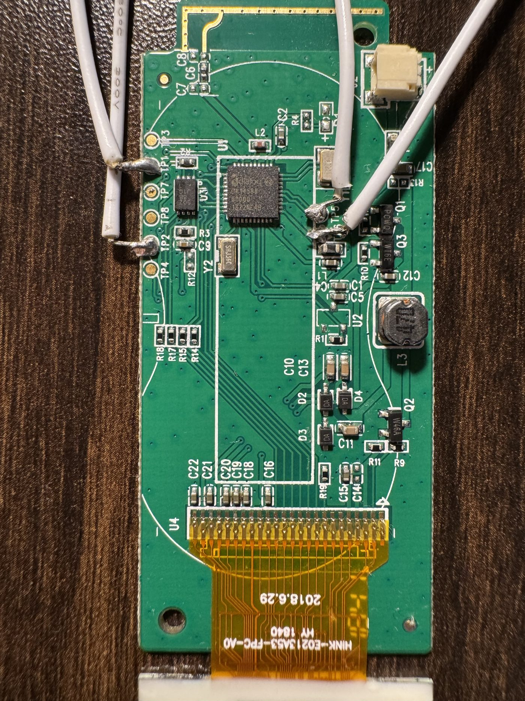

# Finding the real EPD_DC / EPD_RST / EPD_BUSY (and SPI) pins by continuity test

> **Already answered for this board.** The pin map is resolved, continuity-
> confirmed, and proven by driving the panel — see the table in
> [`README.md`](README.md#pin-map-confirmed), which is what
> `src/epd/epd_ssd1680.h` implements. Keep reading only if you need to redo
> this for a different board revision, or want the method.



The board in question. The DA14585 QFN40 is at centre, the panel's FPC tail
enters at the bottom (labelled `HINK-E0213A53-FPC-A0` = the 122×250 variant),
and the row of `TP*` pads on the left is where the SWD wires are tacked on.

Static analysis of the community firmware couldn't recover which DA14585 GPIOs
drive the panel (see `PROTOCOL_NOTES.md` §10) — this is the practical way to
get real numbers. It's slow the first time, fast once you've done it once.

## What you're solving

The EPD panel connects to the board via an 8-pin FPC connector. Waveshare's
own reference driver for this exact controller family (its
`User/Readme_EN.txt`) confirms the standard pinout for this style of 2.13"
panel:

```
VCC   GND   DIN   CLK   CS   DC   RST   BUSY
```

(`DIN` = MOSI/data-in to the panel, `CLK` = SPI clock. Not guaranteed to be in
exactly this physical order on every board, but it's the standard signal set
you're looking for — confirm actual order by testing VCC/GND first, since
those two are the easiest to identify with zero ambiguity: VCC reads ~3.0-3.3V
DC to ground with the board powered, GND has continuity to any other
known-ground point like a battery negative terminal or exposed shield can.)

You need to answer two questions per signal:
1. **Which physical DA14585 package pin does this net reach?** (continuity test)
2. **Which GPIO port/pin is that package pin?** (datasheet pinout table lookup)

## Tools needed

- Digital multimeter with a continuity/diode-test mode (the one that beeps)
- Fine-tip probes — stock multimeter probes are too fat for QFN40 pins
  (~0.4mm pitch on a 5x5mm package). A cheap pair of "SMD tweezer probes" or
  sharpened test leads helps a lot; some people use a sewing needle taped to
  a probe tip.
- Bright light + magnification (a loupe, phone macro camera, or a cheap USB
  microscope) — you will not reliably identify individual QFN pins with the
  naked eye.
- The DA14585 datasheet PDF (public, no login needed — unlike the SDK). It's
  a QFN40 package; you need "Figure 4: QFN40 Pin Assignment" or equivalent,
  which maps physical pin number → GPIO port/pin (e.g. pin 14 = P0_6). Not
  bundled in the SDK download (that only has a `.chm` API reference); fetch
  it separately from Renesas's product page for DA14585.
- A magnifying look at the board to find pin 1 of the DA14585 (small dot or
  chamfered corner on the package, matching a silkscreen dot/triangle on the
  PCB) — you count package pins counter-clockwise from there (standard QFN
  convention, verify against the datasheet's own pin diagram).

## Safety first

- **Power off and disconnect/remove the battery** before probing. Continuity
  mode pushes a small current through the circuit — harmless to digital
  logic pins, but do this with the board unpowered to avoid false
  readings (a powered pin can make the meter behave oddly in continuity
  mode) and to avoid any risk of shorting something adjacent while you're
  concentrating on a 0.4mm pitch package.
- Discharge the board (hold power button / wait a few seconds) since some
  ESL boards keep a small supercap or coin cell charge.

## Procedure

1. **Identify the FPC connector pins on the board side.** The EPD's flex
   cable plugs into a small connector (often a ZIF/FPC socket). With the
   flex removed, you can probe the connector's pads directly — usually
   easier than probing the flex itself.

2. **Confirm VCC and GND first** — these are the easiest and give you a
   coordinate system for the rest of the connector:
   - GND: with the board powered off, continuity-test each connector pad
     against a known ground (battery negative terminal, or any large copper
     pour / shield can on the board). Exactly one pad should beep.
   - VCC: power the board on (careful, other pins are live now — don't use
     continuity mode with power applied), switch the meter to DC voltage,
     and probe each pad against GND. One should read close to the board's
     regulated rail (commonly 3.0-3.3V for these panels).
   Power the board back off before continuing.

3. **Trace the remaining 6 pads to the DA14585 package**, one at a time,
   with the board unpowered and in continuity mode:
   - Black probe on the FPC pad you're testing.
   - Red probe walked around the DA14585 package edge, pin by pin, watching
     for the beep/low-resistance reading.
   - **Write down which physical package pin number beeps for each pad.**
   Do this for all 6 remaining signals (DIN, CLK, CS, DC, RST, BUSY). If a
   pad doesn't beep against any DA14585 pin directly, it may go through a
   passive component first (a series resistor, common on CS or RST lines) —
   in that case, probe the *other end* of that component instead; continuity
   through a resistor of a few hundred ohms or less will often still register
   in diode/continuity mode, but if not, switch to resistance (Ω) mode and
   look for a low, stable reading instead of an open circuit.

4. **Translate package pin numbers to GPIO names** using the datasheet's
   QFN40 pin assignment table/diagram (e.g. "pin 23 → P1_2"). Every DA14585
   GPIO pin in the datasheet is labeled directly with its port/pin — no
   further lookup needed.

5. **Update the firmware.** Once you have the six values, edit
   `src/epd/epd_ssd1680.h`:
   ```c
   #define EPD_DC_PORT      GPIO_PORT_x
   #define EPD_DC_PIN       GPIO_PIN_y
   #define EPD_RST_PORT     GPIO_PORT_x
   #define EPD_RST_PIN      GPIO_PIN_y
   #define EPD_BUSY_PORT    GPIO_PORT_x
   #define EPD_BUSY_PIN     GPIO_PIN_y
   ```
   and `src/config/user_periph_setup.h`:
   ```c
   #define SPI_CLK_PORT  GPIO_PORT_x   // CLK
   #define SPI_CLK_PIN   GPIO_PIN_y
   #define SPI_DO_PORT   GPIO_PORT_x   // DIN / MOSI
   #define SPI_DO_PIN    GPIO_PIN_y
   ```
   (`SPI_DI` / MISO is unused by the panel — leave the template default, it
   doesn't matter if it's wrong since nothing reads from the panel over SPI.)

   **CS goes in `epd_ssd1680.h` as `EPD_CS_PORT`/`EPD_CS_PIN`, not as the SDK's
   `SPI_EN`.** The driver has to hold CS low across a whole command+data burst,
   so it drives it as a plain GPIO with `GPIO_SetActive`/`GPIO_SetInactive`.
   Configured as the hardware `PID_SPI_EN` function it will not respond to
   those calls, and the panel ignores everything you send.

6. **Reserve every pin you configure.** Add a `RESERVE_GPIO()` line for each
   one in `GPIO_reservations()` (`src/platform/user_periph_setup.c`). Under
   `DEVELOPMENT_DEBUG` the SDK halts on `__BKPT(0)` at the first unreserved
   pin, which presents as a firmware hang rather than as an error message.

## Shortcut if you don't want to fully disassemble the board

If desoldering/removing the panel's flex isn't appealing, you can instead
probe from the **DA14585 side outward**: pick a candidate GPIO pin on the
package, beep it against each of the 8 FPC pads (with the flex still
connected) until you find a match, and repeat for the other 7. Slower
per-pin but avoids extra disassembly.

## A much stronger technique, if you still have the original firmware flashed

If you haven't erased the tag yet, this beats blind continuity tracing for
figuring out *which signal is which* (though you'll still need continuity
testing to get exact port/pin numbers): power the board on with the stock
firmware running, and use an **oscilloscope or logic analyzer** (if you have
access to one — even a cheap 8-channel USB logic analyzer like a Saleae
clone works) probed across all 8 FPC pads simultaneously while the tag does
a screen refresh (trigger one via the BLE app, or just wait for its periodic
clock update). You'll see instantly:
- Which line toggles fast and continuously → **CLK**
- Which line carries serial data alongside CLK → **DIN**
- Which line pulses briefly around each byte on CLK/DIN → **CS**
- Which line changes state once or twice per refresh (not per-byte) →
  **DC** (low during command bytes, high during data bytes — you'll see it
  flip at clear boundaries)
- Which line pulses briefly at the very start → **RST**
- Which line goes high (or low, depending on polarity) for the ~1-2 second
  duration of the refresh and then returns → **BUSY**

That identifies *signal roles* with certainty from behavior alone, no
datasheet cross-referencing needed for the panel side — you'd only still
need the continuity test to map whichever DA14585 package pins those
FPC pads reach back to GPIO port/pin numbers.
